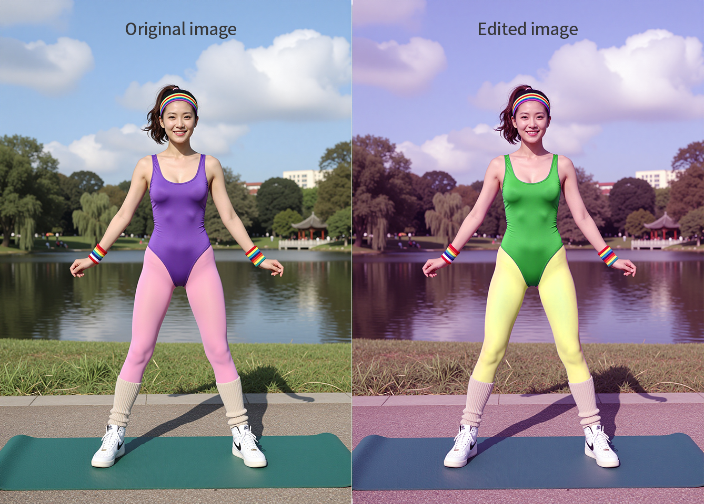
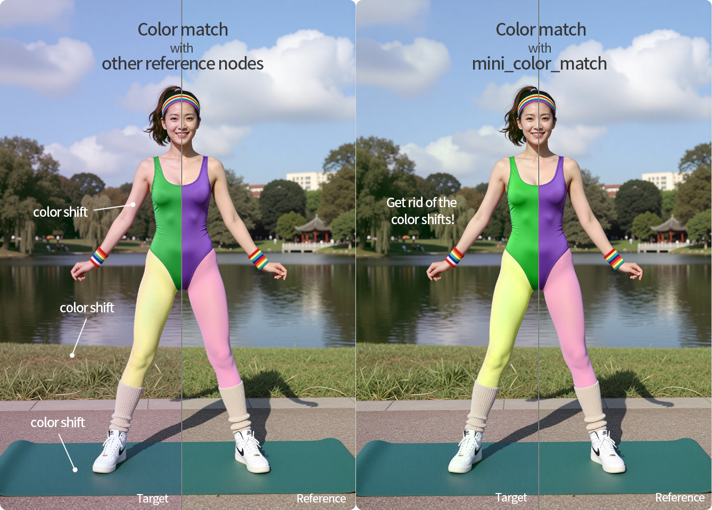
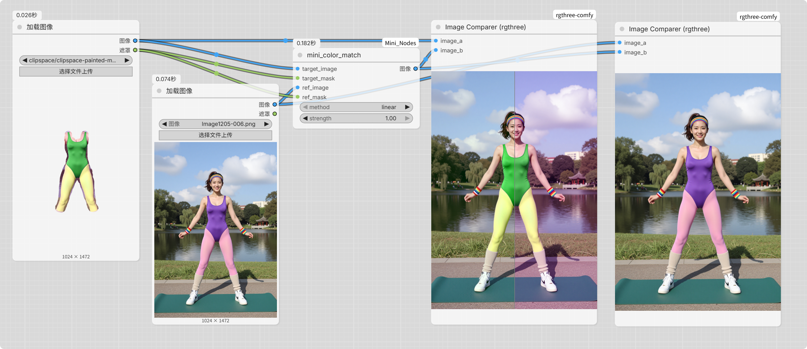
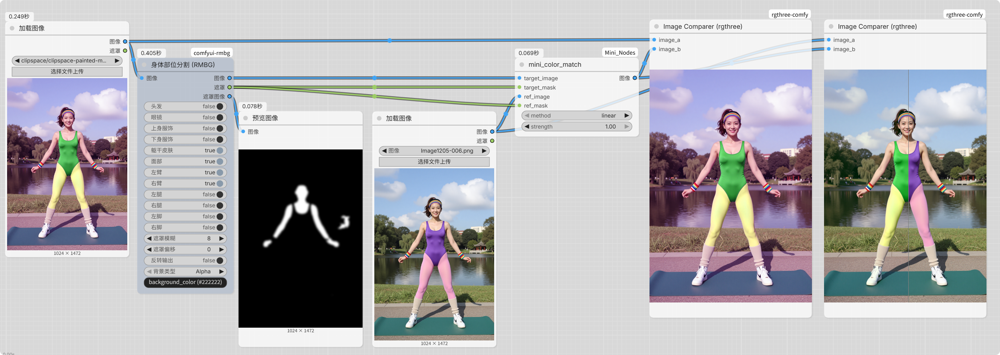
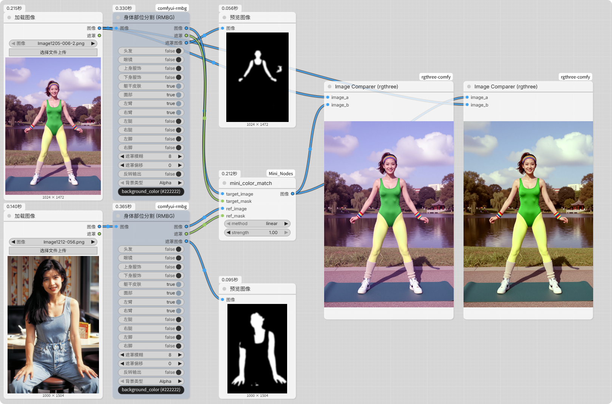
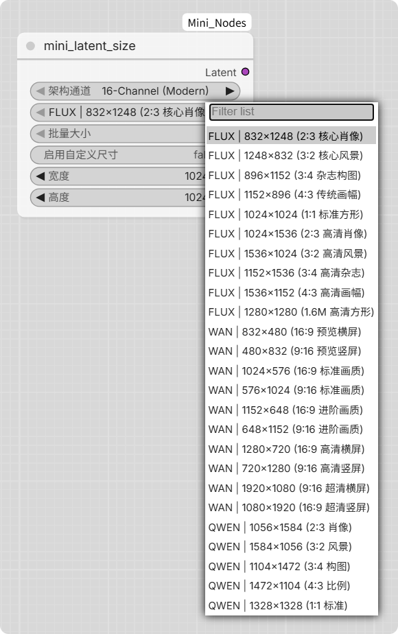

# ComfyUI Mini Nodes

[](https://opensource.org/licenses/MIT)
[](https://github.com/comfyanonymous/ComfyUI)
(https://github.com/comfyanonymous/ComfyUI)


[**🇨🇳 中文说明 | Chinese Readme**](README_zh.md)

> A collection of simple custom nodes for ComfyUI, featuring color matching, latent size adjustment, and metadata-aware image saving.

# UPDATE HISTORY #

🚀 v1.0.2 Algorithm Update Notes
This update fully upgrades the color correction engine from basic linear shifting (Linear/Mean) to high-precision solutions based on industrial-grade statistics and frequency band decomposition. While improving fidelity, each algorithm has specific limitations in certain scenarios due to its underlying mathematical logic.

Algorithm Advantages & Limitations
MKL (Monge-Kantorovich Linearization) — Versatile Balanced Alignment
Advantages: Replaces the legacy linear solution. It synchronizes correlations across all channels via a covariance matrix to achieve natural and balanced global color transfer.

Defects/Disadvantages: As a global linear mapping, it cannot handle local lighting conflicts. If the reference image contains extreme color blocks (e.g., an oversized background color), it may cause unnecessary global color cast in the target image.

Wavelet (Frequency Separation) — Detail & Texture Protection
Advantages: Applies compensation only to the low-frequency color layer, preserving 100% of high-frequency texture details like skin and fabric.

Defects/Disadvantages: Highly dependent on compositional consistency. If the compositions differ (e.g., subject misalignment), colors from the reference image will be incorrectly mapped to the target's spatial coordinates like "ghosting," leading to local color contamination.

HM (Histogram Matching) — Extreme Color Correction
Advantages: Forcibly aligns pixel cumulative distribution, offering powerful correction for materials with massive lighting gaps or severe color shifts.

Defects/Disadvantages: The most destructive method. Because it forcibly reorganizes pixel distribution, overuse can lead to color banding in shadows or highlights and introduce noise. It is not recommended for assets where lighting is already similar.

Summary & Recommendations
Identical Composition: Use Wavelet as the primary choice for the best image quality.

Different Composition / Standard Correction: Use MKL for the most robust color transitions.

Massive Color Discrepancy: Try HM for aggressive "brute-force" alignment.

----------------------------------------------------------------------------------------------------------------------------------

🚀 v1.0.1 Core Node Upgrade: mini_color_match
Designed specifically for outpainting workflows and character skin-tone consistency, this update eliminates the "sampling offset" caused by mismatched image dimensions, significantly improving color matching precision.

Key Enhancements
Decoupled Spatial Sampling:
The node no longer forces the reference image to resize or crop to match the target. It now performs independent pixel sampling in the original coordinate space of each image. This ensures that even with different aspect ratios, the skin tone statistics remain accurate as long as the masks are placed correctly on the respective faces.

Intelligent Optional Masks:
Mask inputs are now optional. If no masks are connected, the node automatically switches to a "Full-Frame Match" mode, using global image statistics for quick grading.

High-Sensitivity Sampling Threshold:
The pixel extraction threshold has been lowered from 0.5 to 0.1. This allows the algorithm to capture feathered mask edges, resulting in a much more delicate and natural color transition.

Enhanced Balanced Linear Matching:
The contrast scaling limit has been expanded from 0.85–1.15 to a more robust 0.5–2.0. This enables the node to handle drastic lighting differences, making it easier to achieve deep cinematic color transfers from "modern digital" to "90s film aesthetic".

Pro Tip: For the best results in outpainting, draw a mask over the target face and the reference face separately. The node will precisely align the skin tones regardless of image positioning.

## 📦 Features

### 🎨 Color Match Node
Are you frustrated by color shifts introduced by image editing models? Standard color matching nodes often fall short. This node provides a precise solution.



As shown, edited images suffer from both passive color shifts (from the model) and active color changes (due to content differences like clothing, pose, or perspective). Using the entire original image as a reference fails to accurately correct these shifts.



The `mini_color_match` node solves this by using an input mask to select only the unchanged pixels as a reference, resulting in a color correction that closely matches the original.



Furthermore, besides manual masks, you can use other segmentation nodes for automated selection (e.g., segmenting skin tones is highly recommended).



Since the target mask and reference mask are separate inputs, you can even use a differently styled reference image (again, using skin tones as a reference on both) to achieve stylized color grading.



**Options:**
- **Method**: 
  - `linear`: "Scales R, G, B independently. Strongest color match."
  - `unbalanced_linear`: "Scales R, G, B uniformly. Balances color and contrast."
  - `mean`: "Only shifts the mean value. Preserves original contrast."
- **Strength**: Controls the intensity of the effect, from `0.0` (no effect) to `1.0` (full effect).

---

### 🔍 Latent Size Adjuster
Quickly select latent dimensions with presets for speed and efficiency.



**Options:**
- **Architecture Channels**: Select based on your model's tensor type to avoid "Dimension Mismatch" or "Shape Error".
  - `16-channel (Default)`: Compatible with most popular models (FLUX.1, QWEN-IMAGE, WAN2.1/2.2, Z-IMAGE, SD3, etc.).
  - `4-channel`: For older models (SD1, SD1.5, SDXL1.0, etc.).
  - `128-channel`: For newer models (FLUX2, FLUX2.KLEIN, etc.).

---

### 💾 Image Save with Metadata
Easily toggle whether to embed your workflow metadata into the saved image file via a simple boolean switch.

---

## 🚀 Installation

1. Open your ComfyUI directory.
2. Navigate to the `custom_nodes/` folder.
3. Run the following command:
   ```bash
   git clone https://github.com/catmaxj/comfyui-mini-nodes.git
There are no additional dependencies. Simply restart ComfyUI, search for the node names, and drag them into your workflow.

📜 License
This project is licensed under the MIT License. See the LICENSE file for details.
